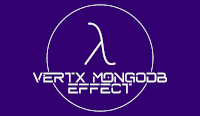

### Hi there 👋, my name is Rafael Merino
#### I am functional developer

Skills: JAVA / SCALA / CLOJURE / LISP / ERLANG / Functional Programming / Actors

- 🔭 I’m currently working on JIO. 
- 🌱 I’m currently learning Scala3 and STM 
- 👯 I’m looking to collaborate on anything releated to FP 
- 🤔 I’m looking for help with any of my projects 
- 📫 How to reach me: imrafaelmerino@gmail.com 
- 😄 Pronouns: he 
- ⚡ Fun fact: Lisp is the first functional programming language, and the second oldest programming language still in use 

List of projects in chronological order and their making-of:

- [json-values](https://github.com/imrafaelmerino/json-values) 

- [vertx-effect](https://github.com/imrafaelmerino/vertx-effect)

- [vertx-effect](https://github.com/imrafaelmerino/vertx-mongodb-effect)

- [mongodb-values](https://github.com/imrafaelmerino/mongodb-values) 

        
